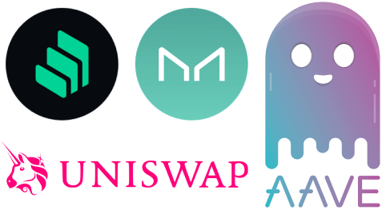

  

<h1 align="center">DeFi Playground 📈😱🚀</h1>

🙋‍♂️ I made this repo to teach myself, "how to do x with y" where "y" is a DeFi protocol.

## Requirements

1. Node.js v14+
2. [Alchemy](http://alchemyapi.io/) - Make an alchemy account and set the `ALCHEMY_API_KEY` environment variable in the .env file
3. Run `yarn` to install dependencies
4. Run `yarn test` to test the implementations

## [Compound Finance](https://compound.finance/)

### Helpful Reading

- 💽 [Interfaces](./contracts/compound) we use to interact with Compound's contracts
- ＃ [Addresses](./test/compound/utils/consts.ts#L1) we use to connect to the mainnet deployed contracts
- ⚡️ Check [Fixtures](./test/compound/utils/fixtures.ts#L25), we use these to setup our tests
- 📜 Compound Docs for [cTokens](https://compound.finance/docs/ctokens), [Comptroller, ie: controller](https://compound.finance/docs/comptroller)

### 🤔 How tos?

1. 💰 [How to `deposit` a token and get back a interest bearing cTokens?](./test/compound/01_deposits.test.ts#L19)
2. 💸 [How to `withdraw` / `cash out` your tokens by returning cTokens?](./test/compound/01_deposits.test.ts#L36)
3. 🤔 [How to `earn interest` on your token deposits? (Demonstration)](./test/compound/01_deposits.test.ts#L65)
4. 🏦 [How to take a `loan` and borrow tokens after setting a collateral?](./test/compound/02_borrow.test.ts#L22)
5. ⚖️ [How to check the balance you `borrowed`?](./test/compound/02_borrow.test.ts#L40)
6. 🥳 [How to `repay` the loan?](./test/compound/02_borrow.test.ts#L45)
7. 📈 [How to calculate the `exchange rate` of cTokens?](./test/compound/03_prices.test.ts#L20)
8. 📦 [How many `underlying tokens` does the compound contract holds?](./test/compound/03_prices.test.ts#L39)
9. 🧐 [How to check the `total supply` and `total borrows` of a token?](./test/compound/03_prices.test.ts#L44)
10. 🙋‍♂️ [How to calculate the `supply APY` and `borrow APR` of a token?](./test/compound/03_prices.test.ts#L51)

## [Aave V2](https://app.aave.com/markets)

### Helpful Reading

- 💽 [Interfaces](./contracts/aave_v2/) we use to interact with Aave V2 contracts
- ＃ [Addresses](./test/aave_v2/utils/consts.ts#L1) we use to connect to the mainnet deployed contracts
- ⚡️ Check [Fixtures](./test/aave_v2/utils/fixtures.ts#L25), we use these to setup our tests
- 📜 Aave V2 Docs for [Lending Pool](https://docs.aave.com/developers/the-core-protocol/lendingpool), [Price Oracle](https://docs.aave.com/developers/the-core-protocol/price-oracle), [aTokens](https://docs.aave.com/developers/the-core-protocol/atokens) and [FAQs](https://docs.aave.com/developers/glossary)

### 🤔 How tos?

1. 💰 [How to `deposit erc20 token` and get back interest bearing `aTokens`?](./test/aave_v2/01_deposits.test.ts#L20)
2. 💸 [How to `withdraw/cashout erc20 tokens` by returning back `aTokens`?](./test/aave_v2/01_deposits.test.ts#L45)
3. 🤔 [How to `earn interest` on your `erc20 token` deposits?](./test/aave_v2/01_deposits.test.ts#L74)
4. 🏦 [How to set a particular `erc20 token` as collateral for your loan borrows?](./test/aave_v2/02_borrow.test.ts#L26)
5. 💵 [How to take a `stable interest rate loan` against your collateral?](./test/aave_v2/02_borrow.test.ts#L37)
6. 💱 [How to convert your `stable interest loan` to a `variable interest loan`?](./test/aave_v2/02_borrow.test.ts#L63)
7. 🥳 [How to `repay` the loan?](./test/aave_v2/02_borrow.test.ts#L72)
8. 🧐 [How to get `user data` (ie: total collateral, debt, amount borrowable)?](./test/aave_v2/03_stats.test.ts#L28)
9. 🧐 [How to get `user data` (ie: total collateral, debt, amount borrowable)?](./test/aave_v2/03_stats.test.ts#L28)
10. 🙋‍♂️ [How to get the `supply APY` and `borrow APR` for a `erc20 token`](./test/aave_v2/03_stats.test.ts#L38)
11. ⚖️ [How to get the `price of erc20 token` in `ETH` from aave oracle?](./test/aave_v2/03_stats.test.ts#L51)
12. TBD - Flashloans
